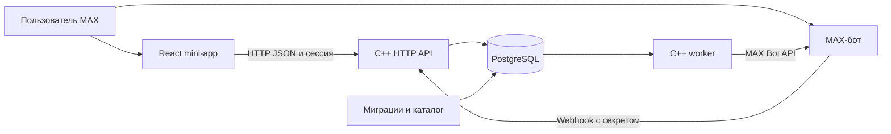

# Архитектура и развитие

## Компоненты

MAX Bridge передаёт подписанные данные запуска мини-приложению. Сервер проверяет их, находит профиль и выдаёт временную сессию. Данные бота и mini-app связаны с одним MAX-пользователем. Отдельных постоянных ролей «ученик» и «наставник» нет: роль определяется конкретным вопросом и откликом.

- `apps/backend`: C++20/Drogon HTTP API, доменные правила, интеграция MAX и фоновая очередь.
- `apps/miniapp`: React/TypeScript; профиль, вопросы, объяснение подбора, диалоги, правила и модерация.
- `packages/contracts`: общие типы данных интерфейса.
- `db/migrations`: схема PostgreSQL и её обновление.
- `data/taxonomy.example.json`: темы и отдельные контекстные признаки; активны только образовательные траектории и карьера.
- `infra` и `scripts`: сборка, первичная настройка, локальный запуск и серверное обновление.

В runtime Node.js не является сервером приложения: HTTP и worker выполняет один C++ бинарник с разными командами. Собранный frontend отдаётся тем же сервером, поэтому пользовательские HTTP-запросы идут на один origin.

## Основной поток

1. Автор сохраняет и публикует вопрос с темой, целью и условиями.
2. Система отбирает подходящие вопросы для помощника по его знаниям и состоянию профиля.
3. Помощник добровольно отправляет отклик; автор выбирает одного участника.
4. Сервер создаёт диалог пары, проверяет доступ к каждому чтению и сообщению.
5. Общение завершается с результатом и следующим шагом. Профили могут поменяться сторонами в другой теме.

Изменения профиля и черновиков используют ревизии, чтобы не перезаписывать новые данные устаревшей формой. Для повторяемых действий предусмотрены ключи идемпотентности. Входящие события MAX и исходящие ответы сохраняются в PostgreSQL и обрабатываются worker с повторными попытками. Это снижает потери при перезапуске; абсолютная гарантия единственной доставки во внешнюю систему не заявляется.

## Подбор компетенций

У темы есть иерархия L1 → L2 → более точные ситуации. Вуз, программа, компания и другие условия представлены отдельными признаками, а не всеми возможными комбинациями узлов дерева.

Отбор сначала использует тематические индексы базы, затем проверяет контекст каждой конкретной компетенции. Проверяются обязательные условия, вид опыта, готовность помогать, активная нагрузка и блокировки. Значения разных компетенций одного пользователя не объединяются в фиктивное совпадение.

Предварительный подбор ограничен выборкой до 1000 компетенций; если лимит достигнут, результат помечается как ограниченный. Это не полный просмотр всех людей и всех уровней и не обещание глобального оптимума. Раздел подходящих вопросов, предварительная оценка доступности и адресные уведомления имеют свои ограничения отбора. Увеличение сообщества требует измерения запросов и уточнения лимитов, а не заявления линейной скорости всей системы без замеров.

## Данные, права и ограничения

Сервер хранит профили, вопросы, отклики, сообщения и историю результатов в PostgreSQL. Учебные роли отделены от настоящих пользователей. В рабочем режиме открытый доступ снимает список приглашённых, но сохраняет проверку подписи MAX, срока сессии и принадлежности данных.

Правила принимаются явно. Пользователь может пожаловаться или заблокировать собеседника. Модератора назначает оператор; доступ к материалам конкретной жалобы журналируется, собственную жалобу модератор не рассматривает. Общее хранилище документов об образовании и независимая верификация дипломов в MVP отсутствуют.

Дополнительные уведомления требуют глобального включения оператором и согласия участника. Подбор и уведомление не означают, что получатель обязан ответить. Локальная учебная версия не отправляет сообщения в MAX.

## План следующего внедрения

| Этап | Что остаётся | Что потребуется |
|---|---|---|
| Одно студенческое сообщество | Два направления, профиль, вопрос, добровольный отклик, диалог | Участники с актуальным опытом, модераторы, действующий MAX-бот, поддержка и доступный сервер |
| Ещё одно образовательное сообщество | Те же сущности и пользовательский путь | Согласовать местные темы/контекст, правила участия, набор помощников и ответственность за обращения |
| Отдельная организация | Та же кодовая база | Независимая установка и база, настройки бота и HTTPS, ответственные за данные и резервные копии |
| Рост нагрузки | HTTP API, очередь и PostgreSQL | Измерить нагрузку, устранить узкие места запросов/лимитов, согласовать число процессов и соединений; распределённую работу принять отдельно |

Для первой группы планируется наблюдать время до подходящего отклика, долю вопросов с диалогом и долю завершённых обращений. Эти показатели не являются уже полученными результатами. Многоорганизационная изоляция внутри одного экземпляра, автоматическая проверка компетенций и масштабирование на произвольную нагрузку пока не реализованы.

[Запуск](LOCAL_RUN.md) · [Пользовательский сценарий](USER_GUIDE.md) · [API](API.md) · [Развёртывание](DEPLOYMENT.md).
